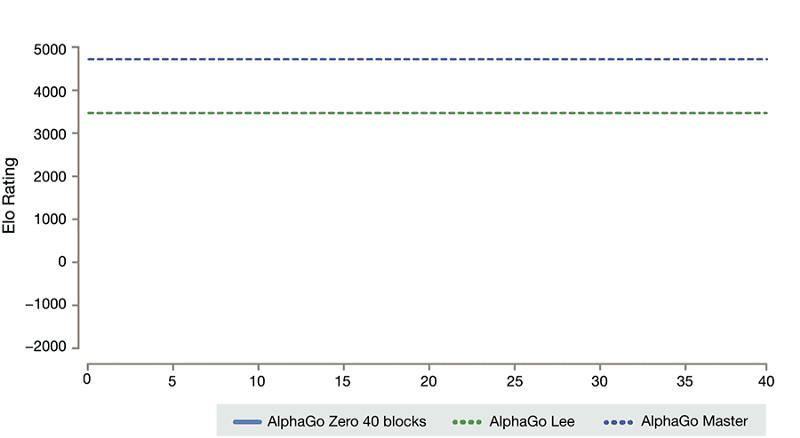

When you hear about AI and computer games, 

[https://storage.googleapis.com/deepmind-live-cms/documents/TrainingTime-Graph-171019-r01.gif](https://storage.googleapis.com/deepmind-live-cms/documents/TrainingTime-Graph-171019-r01.gif) 

[**AlphaGo Zero: Learning from scratch | DeepMind**  
_We introduce AlphaGo Zero, the latest evolution of AlphaGo, the first computer program to defeat a world champion at…_deepmind.com](https://deepmind.com/blog/alphago-zero-learning-scratch/ "https://deepmind.com/blog/alphago-zero-learning-scratch/")

There 

For some games it is easy to create 

-   style transfer 
-   GANs 
-     
    

  

But, IMHO, the biggest 

  

  

  

I see a lot of potential in 

-   TensorFlow.js
-   Fully fledged games in browser

  

  

Fair disclaimer: I don’t work in games.
