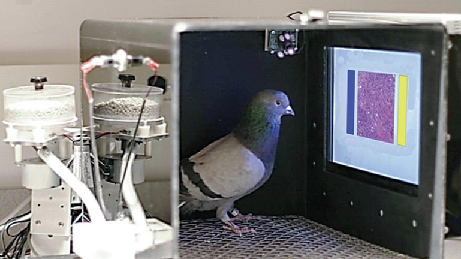

> To err is human? Not anymore!

The field of Artificial Intelligence started with inspiration, and ambition, to imitate our human cognition.

While each particular machine learning algorithm comes with its own artifacts and limitations, some issues are much broader. In fact, there are limitations of any learning process, machine or human alike. I think that it’s worth investigating these, as there is a lot of room for cross-pollination between machine learning and cognitive science.

 by MartaCzC (posted with permission)](./asset-1.jpeg)

### Motivations

We may be able to see some of learning patterns, cognitive biases, and [logical fallacies](https://en.wikipedia.org/wiki/List_of_fallacies) through the prism of machine learning. Moreover, biological systems keep inspiring progress of ML (evolutionary algorithm, artificial neural networks, attention). Or sometimes it turns out that deviating from biological inspirations makes better (e.g. ReLU instead of sigmoid activations in deep learning).

Some problems are theoretical, good for neuroscientists and machine learning researchers. Other mistakes are crucial also for any application — to make sure that we reduce (rather than amplify) social biases, improve safety, etc.

Except for scientific & philosophical curiosity, and ethical & safety concerns, I have also a more down-to-earth — I make my living teaching machine learning.

](./asset-2.png)

It’s handy to have useful analogies and metaphors, showing that machine learning is _“reasoning on steroids”_, rather than some kind of sorcery.

### Machine learning

If you need a general introduction, I wrote [Data science intro for math/phys background](https://p.migdal.pl/2016/03/15/data-science-intro-for-math-phys-background.html) in 2016. To my surprise, it is still up-to-date and useful to people coming from other backgrounds as well.

#### Each computer model is different

Contrary to a public message, there is no “AI” is not a single method. Each method is different, with pros and cons, and there is not even hope for creating “the best one” for all data (so-called _“no free lunch theorem”_).

Computer cognition is different than our own. And depend from algorithm to algorithm. Querying a relational database with SQL is different than asking Alexa. In my opinion, it is useful to compare various approaches, no matter if there are deterministic scripts, statistical models, “shallow” machine learning, or deep learning. All in all, people used the word “AI” for many things (“AI” for opponents in computer games is usually scripts)

Even when we look at classic machine learning classifiers in Scikit-learn (the key Python machine learning library), they differ both with their predictions and the way they arrive at such.

: nearest neighbors, linear support vector machine (SVM), radial-basis function SVM, Gaussian process, a decision tree, Random Forest, etc.](./asset-3.png)

So, which algorithm is the best?  
And which creates is the closest to your intuition?

There is a work-in-progress [Which Machine Learning algorithm are you?](https://github.com/stared/which-ml-are-you) by Katarzyna Kańska and me. For a longer list of interactive tools, see [Interactive Machine Learning, Deep Learning and Statistics websites](https://p.migdal.pl/interactive-machine-learning-list/). And if you like to draw your own classifiers, see [this livelossplot Jupyter Notebook](https://github.com/stared/livelossplot/blob/master/examples/2d_prediction_maps.ipynb).

#### Even deep learning is simple

If you don’t know deep learning yet, it is a bunch of simple mathematics operations (addition, multiplication, maximal value).

Learning about deep learning made me think that it is not deep learning doing magic… it’s our cognition that is based on heuristics, that are just good enough.

, [paper summary](https://www.sciencemag.org/news/2015/11/pigeons-spot-cancer-well-human-experts)) or MNIST recognition using (deep!) spreadsheets: [www.excel.net](https://www.excel.net/)](./asset-5.png)

Don’t take me wrong: mastering deep learning is hard and takes time (as of any specialized activity). But if you want to start playing with that, if you know Python, you can write your first network today, vide:

-   [Learning Deep Learning with Keras](https://p.migdal.pl/2017/04/30/teaching-deep-learning.html) (2017)
-   [Keras or PyTorch as your first deep learning framework](https://deepsense.ai/keras-or-pytorch/) (2018)
-   [Thinking in Tensors, writing in PyTorch](https://github.com/stared/thinking-in-tensors-writing-in-pytorch/) (work in progress)

If you think that _“oh, recognizing images can be done by machines, but feelings, sentience, spirituality, and deep motivations are inherently human”_, I recommend reading [Consciousness Explained](https://en.wikipedia.org/wiki/Consciousness_Explained) by Daniel Dennett (and in general the philosophy of mind camp). It does the job at de-enchanting consciousness itself.

### Let’s learn from mistakes

If we get the correct answer to our question, we are happy… but that’s it.

> Everyone knows that dragons don’t exist. But while this simplistic formulation may satisfy the layman, it does not suffice for the scientific mind. \[…\] The brilliant Cerebron, attacking the problem analytically, discovered three distinct kinds of dragon: the mythical, the chimerical, and the purely hypothetical. They were all, one might say, nonexistent, but each non-existed in an entirely different way. — [Stanisław Lem, The Cyberiad](http://Everyone%20knows%20that%20dragons%20don’t%20exist.%20But%20while%20this%20simplistic%20formulation%20may%20satisfy%20the%20layman,%20it%20does%20not%20suffice%20for%20the%20scientific%20mind.%20The%20School%20of%20Higher%20Neantical%20Nillity%20is%20in%20fact%20wholly%20unconcerned%20with%20what%20does%20exist.%20Indeed,%20the%20banality%20of%20existence%20has%20been%20so%20amply%20demonstrated,%20there%20is%20no%20need%20for%20us%20to%20discuss%20it%20any%20further%20here.%20The%20brilliant%20Cerebron,%20attacking%20the%20problem%20analytically,%20discovered%20three%20distinct%20kinds%20of%20dragon:%20the%20mythical,%20the%20chimerical,%20and%20the%20purely%20hypothetical.%20They%20were%20all,%20one%20might%20say,%20nonexistent,%20but%20each%20non-existed%20in%20an%20entirely%20different%20way.)

Usually, we can be right in one way but mistaken in infinitely many ways. And each of these reveals something about the cognitive process. Think about: Freudian slips — “_when you say one thing, but mean your mother”_. In a similar vein, word vectors can carry connotations, including undesirable ones (vide [How to make a racist AI without really trying](http://blog.conceptnet.io/posts/2017/how-to-make-a-racist-ai-without-really-trying/)). I recommend taking the [Implicit Bias test](https://implicit.harvard.edu/implicit/takeatest.html) to see what are your unconscious biases for/against people of a given gender, age or ethnicity.

> The biggest lie of every parent, pet owner and deep learning engineer:  
> “I’ve never shown it that, it must have learned it by itself!”   
>  — Jan Rzymkowski, on my FB wall

People learn a lot about human neuroscience from brain regions being damages, as in the famous book [The Man Who Mistook His Wife for a Hat](https://en.wikipedia.org/wiki/The_Man_Who_Mistook_His_Wife_for_a_Hat) by Oliver Sacks. With machine learning models, so far there is no ethics commission forbidding random experiments on them.

### Posts

So, without further ado, let’s jump to the content:

#### So far

-   [king — man + woman is queen; but why?](https://p.migdal.pl/2017/01/06/king-man-woman-queen-why.html) — touch the subject of analogies and cognitive metaphors with word embeddings such as word2vec or GloVe
-   [Does AI have a dirty mind, too?](https://medium.com/@marekkcichy/does-ai-have-a-dirty-mind-too-6948430e4b2b) with [Marek K. Cichy](https://medium.com/u/5bf0995463b) (racy adversarial examples, or: seemingly NSFW illusions fooling nude picture detectors)

#### Intend to write

But there are more coming!

-   Overfitting — rote learning, superstitions, nipples and conspiracy theories
-   Dreams, Drugs and ConvNets — seeing patterns, in vivo & in silica
-   Scalar fallacy —binary is bad, scalars are not enough
-   AI is not an Abrahamic God — image classification is a reality, AGI and transhumanism are still sci-fi
-   Draw a 2d-classifier — an open-source game
-   YOLO?! Object (mis)classification and safety

If you have suggestions which you would like to read the most, leave them in comments.

#### Warning

And a fair warning, a lot of these posts will contain dangerous content.

 is not a checklist!](./asset-6.png)

---

Interested? Follow me at Twitter [@pmigdal](https://twitter.com/pmigdal), [github.com/stared](https://github.com/stared) and at my homepage [p.migdal.pl](https://p.migdal.pl/).
