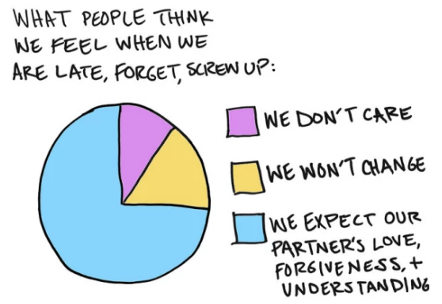
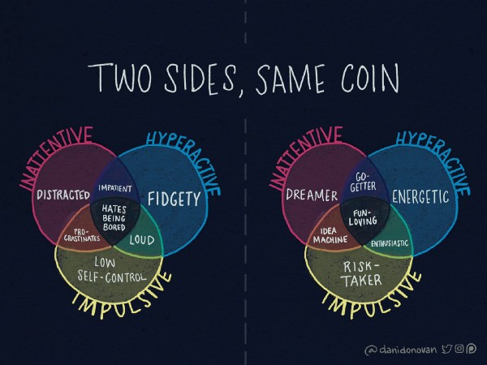
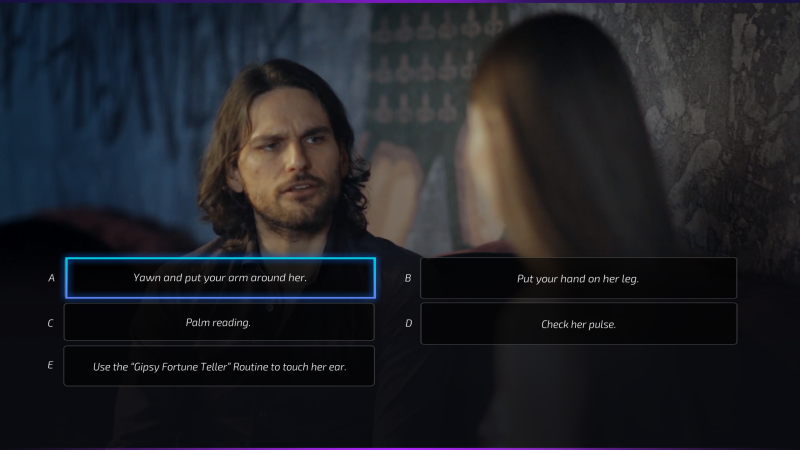

After writing [Dating for nerds (part 1): problem diagnosis](http://p.migdal.pl/2017/07/23/dating-for-nerds.html) a few times if it is dating for aspies in a disguise. Well, here we go! Of course, I mean “_\[dating for aspies\] in a disguise_”, not “_dating for \[aspies in a disguise\]_”. Though, 

Moreover, while I was afraid that [Dating for nerds (part 2): gender differences](https://p.migdal.pl/2017/09/30/dating-for-nerds-gender-differences.html)

After writing I expected to be burned on the stake, especially after touching evolutionary aspects. Instead, I got a lot of positive reception from female friends, asking me if there will be 

Outline

-   Intro (you hare here)
-   General social skills
-   Introversion and sensitivity
-   Autism spectrum
-   Other mental challenges
-   What matters to other people
-   Hacks

  

 by Nathan W. Pyle](./asset-1.png)

You may say that dating is the cherry on the cake of social skills is a high peak for aspies. I dared to [teach quantum mechanics to high-school students](https://p.migdal.pl/2016/08/15/quantum-mechanics-for-high-school-students.html) and [AI to everyone](https://p.migdal.pl/2017/04/30/teaching-deep-learning.html), so I have enough hubris to write about it. If you think that it takes a book, not a blog post, to teach aspies social skills — well, there is a catch.

I link to a few books and YouTube channels, which I’ve found the most useful.

---

In this episode, I will cover some common issues. Many things will be about features of your personality, which is neither good nor bad — but it’s crucial to be at least aware of them and how they influence social relationships. Other traits need accommodation, as don’t take into account the neurotypical preference for interaction. A large portion of materials will be derived from those from Asperger Syndrome / High-Functioning Autism. For the sake of this blog post, it is irrelevant if you a fully-fledged aspie or just exhibit some of its traits.

The common wisdom is that neurotypical ARE naturally better at reading other people than aspies. I used to believe that, but now I am less sure. 

  from [Catherine Compton’s tweet](https://twitter.com/cjcrompton/status/1120321767082549249)](./asset-2.png)

Sadly, [Autistics make others uncomfortable, instantly](https://www.tameri.com/wordpress/autisticme/2018/01/13/autistics-make-others-uncomfortable-instantly/). 

### Social skills in general

Why do we need formal classes for mathematics, but it is assumed that we magically pick social skills on our own? There isn’t much general life advice I consider worth reading. One that is:

-   [All the evidence-based advice we found on how to be successful in any job](https://80000hours.org/career-guide/how-to-be-successful/) by 80000h

Among other valuable points, it suggests **making mental health one’s top priority** and **improving one’s basic social skills**. It mentions:

-   [Succeed Socially](http://www.succeedsocially.com/) by Chris MacLeod (which is very [Autism-focused](https://www.succeedsocially.com/aspergersdiagnosis)); its tagline is: _Manage Shyness, Improve Your Conversations, and Make Friends, Without Giving Up Who You Are_

Which I haven’t read yet, but just skimming through its parts makes me persuaded it’s a wonderful source for an array of nerd social problems. 80000h somehow dismiss a classic book:

-   [How to Win Friends and Influence People (1936)](https://en.wikipedia.org/wiki/How_to_Win_Friends_and_Influence_People) by Dale Carnegie

I really encourage going through it, as it focuses on some key issue with nerds — thinking than facts are enough to persuade people. I read it only 3 years ago — and since then bought 5 copies just to lend or give it to others. Sure, there is an undernote of _the American religion of business_ (which is its style rather than content), but except for that — most of its advice is timeless.

Another very wise book is [Nonviolent Communication (NVC)](https://en.wikipedia.org/wiki/Nonviolent_Communication) by Marshal Rosenberg. There is a nice overview: [How to Deliver Constructive Feedback in Difficult Situations](https://medium.com/s/please-advise/the-essential-guide-to-difficult-conversations-41f736e63ccf) by [Dave Bailey](https://medium.com/u/76d546ffa445).

### Introversion and sensitivity

](./asset-3.png)

Current Western culture is pretty much targeted at extroverts, with introverts being second-class citizens. If you are an introvert, you don’t need to be shy about it! There are plenty of us around — we are a sizable minority! See:

-   [The power of introverts](https://www.ted.com/talks/susan_cain_the_power_of_introverts) — a TED talk by Susan Cain (2012)

She wrote a rich in detail _introvert emancipation book_:

-   [Quiet: The Power of Introverts in a World That Can’t Stop Talking](https://en.wikipedia.org/wiki/Quiet:_The_Power_of_Introverts_in_a_World_That_Can%27t_Stop_Talking)

which shows the skills and qualities of introverts, which are often overlooked and underappreciated in our contemporary culture. It also mentions contemporary social expectations for dating, where the louder the better:

> men were now expected to launch verbally sophisticated courtships in which they threw women a line of elaborate flirtatiousness. \[…\] Women, too, were expected to walk a fine line between propriety and boldness. If they responded too shyly to romantic overtures, they were sometimes called frigid.

Contrary to popular opinion, [introverts can be great leaders](https://betterhumans.coach.me/how-to-leverage-introversion-as-a-career-strength-7a1c0371f2fa). For introversion, coupled with overthinking and living in an inner world, a few insights can be derived from the [Romantic Relationships](https://www.16personalities.com/intp-relationships-dating) section from the description [INTP personality](https://www.16personalities.com/intp-personality). Yes, I use MBTI for casual conversations (as in _“She’s INFP!”_), [but not academic quality](https://sapa-project.org/dmc/blog/myersbriggs.html)). XXX colors of mana

Much generic advice starts with how to meet prospective partners in the loud, unintellectual space of bars and clubs — one of the least favorite places for nerds.

  

As a person who hates small talks, and for whom “two is a company, three is a crowd”

From [How To Flirt As An Introvert](https://www.youtube.com/watch?v=j4b5T-RAgec) by Charisma on Command (I will reference its channel a lot), it suggests:

-   Go to an event/activity you have a non-romantic interest in
-   Wear your interest on your chest
-   Ask open-ended questions
-   Once they elaborate, you can relate/Connect on values
-   Ask them out by acknowledging the social situation, say what you think about them, & invite them to something fun

### Autism spectrum

If you are a nerd you may have traits of Asperger syndrome, some time ago I wrote [Autistic traits, science and the nerd stereotype](http://crastina.se/autistic-traits-science-and-the-nerd-stereotype/) with some links. Note that [Sheldon from Big Bang Theory may reinforce some negative stereotypes](https://seeingdoubleautismawareness.wordpress.com/2015/06/18/the-aspergers-geek-and-why-this-stereotype-is-damaging/). If you are anywhere near to Asperger syndrome, or your crush or partner is, this text is invaluable:

-   [A Mind-Body Look at the Concept of Asperger’s Syndrome](http://www.michaelsamsel.com/Content/Asperger/asperger%27s_html.html) ([pdf](http://www.michaelsamsel.com/Content/Asperger/Asperger%27s%20Mind%20Body%20Approach.pdf)) by Michael Samsel

I read it 3 years ago, and still learned a lot from it! It gives a list of the differences between aspie and neurotypical behavior in areas when it is likely to cause conflict. One was particularly insightful:

> However, social norms are far from fixed, even in the same social group. That is, they are very context-specific. For instance hugging a stranger in English class violates a social norm, but hugging may in fact be the norm with the same stranger when a late campfire at the beach is breaking up. **The difference is how people feel in those situations generally.** Of course what a person feels specifically in a situation is a bottom line on appropriateness, but someone following a social norm is ‘given a pass’ even when the specific gesture is unwanted, if in the situation generally it would be wanted. In that way, social norms are sometimes considered ‘safe havens,’ but they cannot be mechanically applied. When a behavior is both violating a social norm and unwanted, and the doer is of an age to ‘know better’, bad motives are attributed to that person.

A very problematic thing for the literal-minded is: which rules are serious and which are only guidelines. For that matter, when in a social setting, asking a co-worker for a coffee meeting most likely is OK. Keeping on doing that isn’t. Asking that during a job interview — isn’t.

> _Synchrony_ is a **_prompt_** and relevant response by others to what we do and say. _Reciprocity_ is a balance between give and take over the course of the relationship. \[…\] **Most neuro-typicals desire synchrony more than reciprocity,** at least face-to-face. This is why cocktail parties are popular — nothing much is exchanged except synchrony, which can become the basis to start a relationship.

For a wonderful list of main pain-points, look at its [Interpersonal Traits of Aspies Placed in Context](https://gist.github.com/stared/00ce50e95f9bcecc8965feb04650c19d) chapter. I was tempted to quote a point or two… but it seems that at least half of the points are related to dating. If some of these points resonate with you, I urge you to take this list and go point-by-point with a neurotypical friend. They will cringe a bit but may provide priceless feedback.

> So much of dating and sexuality is supposed to be indirect and subtle. And that it is inappropriate to talk about sex in a direct way… even if you are teaching it. \[…\] No one is teaching the social aspect \[of sex\]. It is were autistic people are the canaries in the coal mine. Teaching the social aspect of sexuality would help everyone. Autistic people NEED it, but it also benefits everyone.

### Other mental problems

Say, you are different — you have things in which you shine, but also your struggle. Some things are either ones you cannot change (e.g. a short person cannot just become tall; same thing works for many psychological traits), some you don’t want, some are the deepest and most important aspect of your personality. You want to be the best version of yourself, not a boring person pretending to be someone different. A very healthy approach to how to deal.

 by Caroline Kee](./asset-5.png)

[What to Say Instead of I’m Sorry](https://www.youtube.com/watch?v=R-k1ggPxEbg) by [HowToADHD](https://www.youtube.com/howtoadhd) (she has a series on relationships as well, e.g. [ADHD and Relationships: Let’s Be Honest](https://www.youtube.com/watch?v=XbyN8REIhMk)). She said:

> You are not weird. You are not stupid. You do not need to try harder. You are not a failed version of normal. You are different. You are beautiful. And you are not alone. — [Jessica McCabe](https://medium.com/u/c8cabf25e06c)

 by [Dani Donovan](https://medium.com/u/d045bf184d2a)](./asset-7.jpeg)

There is a word “neurodiverse” (in the opposition of “neurotypical”), originating from Asperger communities, 

Another possibly comorbid thing is prosopagnosia — the inability to recognize faces ([a story how is it similar to distinguishing different stones](http://web.archive.org/web/20080704154655/http://www.prosopagnosia.com/main/stones/index.asp)) may be read as ignoring people, saying raw thoughts can be seen as an insult, etc.

#### No pain Olympics

You may experience 

### What matters a lot to people

#### Their needs

By far the most important link in the whole blog post, is

-   [Dale Carnegie, How to Win Friends and Influence People (1936)](https://en.wikipedia.org/wiki/How_to_Win_Friends_and_Influence_People)

as it exactly covers the soft approach nerds struggle with. What I like is the main premise is that every person wants to feel important (no matter if it is a janitor or a world-class author) and if you make them feel such in a genuine way, it will do wonders for your contact. While this book is not about dating, it captures fundamental of this soft human interactions.

On a lighter note (or way grimmer, depending )in the same vein, look at

-   [Why Tyrion Can’t Be Killed](https://www.youtube.com/watch?v=qMliNd2b2K0)
-     
    

You won’t land a job, or a date, because you desire something or someone. You get it/them, because they want you (either from the very beginning or you attract them in so). The good news is that it’s not the Game of Thrones, so your neediness may make you lose a date, not — get your throat slit.

#### Context / frame

For neurotypicals context is super-important. A question which is fine when strolling together in a park may be considered harassment in the workplace. Or even when you are together at one’s place, saying out of blue _“do you want to make love with me”_ is totally different from saying it when you are cuddling.

[Charisma on Command](https://www.youtube.com/channel/UCU_W0oE_ock8bWKjALiGs8Q) is by far my favorite channel for social skills. 

> Let’s talk about the core of all communication — the thing that determines how persuasive you are if you get what you want. In the case of this video, if you live or die.

Also, there is a book [A Field Guide to Earthlings: An autistic/Asperger view of neurotypical behavior](https://www.amazon.com/Field-Guide-Earthlings-autistic-neurotypical-ebook/dp/B004EPYUV2/) by Ian Ford clarifying the social context and social constructs. And, what may be a surprise for a nerd, that in the neurotypical world communication revolves around forming social coherence and setting one’s own position on a social ladder rather than the exchange of information.

#### Plausible deniability

Sex is not only a social activity but also a very strong symbol, often associated with taboos. Moreover, most people want to “save face” in case the other party is not as much interested in them. And, as importantly, they prefer not to promise too much, but leave situation open-ended and be in control.

> Thirty-nine percent reported that at least once they had said no when they meant yes (demonstrating token resistance), 85% had at one point said no when they meant no, and 69% had said no when they meant maybe at least once.” — research quoted in [Biology as consent:   
> Problematizing the scientific approach to seducing women’s bodies](http://psycnet.apa.org/buy/1988-26427-001) by Amanda Denes

Does it mean that each coffee meeting is a date and each invitation to someone’s place is an invitation for sex? Well, no. Implication does not go that way.

How to deal with this confusion? First and foremost — you can’t all of the time. A lot of it may be conveyed in the context, cultural norms and subtle hints.

-   Propose an activity you like doing anyway

#### Honesty 

Neurotypicals have a different approach to honesty.

How to balance 

  

#### Other tips and hits

  

[One Simple Rule to Overcome Anxiety](https://www.improveyoursocialskills.com/one-simple-rule-to-overcome-anxiety) by Daniel Wendler:

> The [10–10–10 rule](http://www.improveyoursocialskills.com/one-simple-rule-to-overcome-anxiety) is a simple technique for using your mind to overcome your social anxiety. If your anxiety is preventing you from doing something  
> social, ask yourself “If I try this, what is likely to happen 10 minutes in the future? What is likely to happen 10 months in the future? What is likely to happen 10 years in the future?”

  

#### Not boring them to death

I heard an unsolicited gem of advice from a female to a male friend:

> I have one great hint for you. If you apply it, you will be irresistible for girls. Give them space to talk.

 (CC BY-NC)](./asset-8.png)

Actionable:

-   Time-limit your dates
-   Give them ample time to talk (at least 40%)
-   When you talk

#### Taking initiative

If you are a man, like it or not, you have to take the initiative most of the time. And there are quite a few steps

> If a cute girl asked me out I would need a very good reason to say no because that kind of open desire is as hot as it gets.   
> Even if they stammer and mumble through every word, that would be endearing in its own right because it shows that they are willing to step out of their comfort zone to get me…best compliment ever. —   
> William Brown comment from [Why Girls Should Ask Guys Out](https://www.youtube.com/watch?v=RWOBFu2uNXA) by Anna Akana.

#### Is it a date?

For asking for a date, _“Do you want to meet_ **_with me_** _for a coffee?”_ is different than _“Do you want to meet with me for a coffee_ **_to talk about X_**_?”_.

#### Don’t beg or persuade

Begging 

People refrain from giving clear answers for a few reasons:

-     
    

### It is not a game

You may be inclined to see the world as a clockwork system. It [works unreasonably well in science and engineering](https://www.dartmouth.edu/~matc/MathDrama/reading/Wigner.html). For practical social interactions, this approach is rarely useful. For a long time, I thought that “normal” people have some clever insight into the working of a human mind. They don’t. What they do is they don’t over-think, and instinctively act on the social norms, rather than trying to discover some first principles.

There are no methods which work always or for everyone, every time.

It’s not a mathematical problem, where (even if insanely difficult) there is a perfect solution. It’s not a computer program, which works each time the same way. It’s not an RPG game, where someone could give you a hint, in the light of:

](./asset-9.png)

Maybe she flirts with you just because it’s her way of interacting with all people. Maybe he doesn’t talk much because he had a stressful day. Maybe you did something clever, but it intimidated her. Maybe you did something stupid, but he found it funny.

While it helps a lot to pay attention to signs that she may be interested, agonizing over it is likely to result in overfitting — focusing on random things that are mere coincidences.

In social relations, there are no sure solutions. It’s all about increasing odds. Think about a salesman, who wants to sell a product — some people want to buy it no matter what, some won’t, but many people are undecided, and it will all depend on the salesman’s approach (also: if they go back to him to buy more, or feel scammed).

The same thing about dating — in some cases a person is not interested and no amount of dating skills would change that. In some — she is interested and proactive, and you don’t need many skills at all. But the uncertain zone is a big place — and here your skills matter a lot.

Also, you don’t interact with an average girl. Even if there are things that on the average differ by gender (and can be nice initial guesses!), you will always interact with a particular person.

[The Nerd and His Discontent: The Seduction Community and the Logic of the Game as a Geeky Solution to the Challenges of Young Masculinity](https://journals.sagepub.com/doi/full/10.1177/1097184X15613831) by Ran Almog and Danny Kaplan.

  

“Games are for the computer not for relationships.” and “if a girl plays hard to get, I assume she’s not interested and I just forget about her.” from [Why girls shouldn’t play hard to get](https://www.youtube.com/watch?v=d-4fFNfdXKo) by Anna Akana.

#### The game

> Playing a game is the voluntary attempt to overcome unnecessary obstacles. —[ Bernard Suits](https://en.wikipedia.org/wiki/Lusory_attitude)

So, why does feel like a game? Why do people create seemingly unnecessary obstacles? Well, 

  

Whether it is sex or a relationship, it 

My former partner, [Sarah Martin,](https://medium.com/u/39462454f46a) wrote a master’s thesis on _Market metaphors used by Pick Up Artists_. I got some exposure to an array of books on dating, from decent, through questionable, outright evil. By far the best I saw is:

-   [Models: Attract Women Through Honesty](https://www.amazon.com/Models-Attract-Women-Through-Honesty/dp/1463750358) by [Mark Manson](https://medium.com/u/db77b01f3f54)

It is more about one’s mindset than how-tos.

Though, some more concrete steps are required. “Be yourself” does not cut it. Even with the 

-   [The Natural: How to Effortlessly Attract the Women You Want](https://www.amazon.com/Natural-Effortlessly-Attract-Women-Want-ebook/dp/B005HFBQKQ) by Richard La Ruina

There is a game [Super Seducer: How to Talk to Girls](https://store.steampowered.com/app/695920/Super_Seducer__How_to_Talk_to_Girls/) by the same author.

A lot of “bad” answers are super-cringy, and there is a reason you should avoid them. To my surprise, he did it extremely well when it comes to tricky environments, e.g. workplace, in a respectful way. Though, I don’t encourage other parts. [Super Seducer 2](https://www.youtube.com/watch?v=iNkkMMaXSBI), with a few exceptions, is a combination of in-jokes and pure cringe. 

  

#### To online date or not to online date

Online dating is a 

First, 

  

[Tinder anecdata and Sankey diagrams](https://medium.com/@pmigdal/tinder-anecdata-and-sankey-diagrams-c1c0e5dfff18).

### Tips and tricks

[17 Psychological Tricks To Make People Like You Immediately](http://www.iflscience.com/brain/17-psychological-tricks-to-make-people-like-you-immediately/all/) (please forgive its clickbaity title!), with an emphasis on:

-   **smile** — I mean, modify your facial expression; show your emotions (and interest)!
-   **casually touch them** — this one is crucial, but also should be done gradually, with care; and even before: maintain some eye contact!
-   **tell them a secret** — to make them feel special, trusted… and actually, learn something private about you
-   **let them talk about themselves** — for every person the favorite topic is themselves; there is a common issue with nerds in a passionate monologue.

Even the creation of the _feeling of closeness_ can be decomposed. 

 by A. Aron _et al. (_1997). It’s summarized in [How to make a friend fast — the scientific method](http://How%20to%20make%20a%20friend%20fast — the%20scientific%20method) by [Ivana Kurecic](https://medium.com/u/f373ff9f650a)](./asset-11.jpeg)

One really powerful technique is sitting closely while touching each other gently and starring at the eyes of each other.

There are tricks on [How to Bio-Hack Your Brain to Have Sex Without Getting Emotionally Attached](https://broadly.vice.com/en_us/article/59mmzq/how-to-bio-hack-your-brain-to-have-sex-without-getting-emotionally-attached), and you can subvert that if needed.

#### Intention

Even the best techniques have a potential to be used unethically. 

  

[10 Things Sex Positivity Is Not](https://everydayfeminism.com/2016/08/10-things-sex-positivity-is-not/) by Miri Mogilevsky from Everyday Feminism.

#### Gödel, Escher, Casanova 

Tell them “there is one pick-up line that makes every \[wo\]man itrigued”. 

### Silver lining

#### Honesty as a strategy

Traditionally, 

#### Poly, kink and stuff

  

Quantified self

  

[https://www.glamour.com/story/tracked-sex-life-on-spreadsheet](https://www.glamour.com/story/tracked-sex-life-on-spreadsheet)

### Miscellaneous 

[Why Women Want To Have Sex With Garrus](https://kotaku.com/why-women-want-to-have-sex-with-garrus-1793662351) by Mark Serrels from Kotaku. Totally look at the list of why’s.

 by Mark Serrels from Kotaku.](./asset-12.png)

[https://youtu.be/fZ28gGCa\_jI?t=255](https://youtu.be/fZ28gGCa_jI?t=255) Is Thanos hot

### What’s else

Wow, that’s a lot of material!

-   It’s a date/ it isn’t a date z Casually Explained
-   Underpromise and overdeliver
-   [https://www.questionablecontent.net/view.php?comic=9](https://www.questionablecontent.net/view.php?comic=9) — asking
-   Klata
-   Honesty
-   Don’t overoptimize
-   [https://www.reddit.com/r/AutismTranslated/comments/bfvmno/please\_stop\_apologizing\_for\_begging\_for\_your\_life/](https://www.reddit.com/r/AutismTranslated/comments/bfvmno/please_stop_apologizing_for_begging_for_your_life/)
-   Get out of your head and into your body [https://www.youtube.com/watch?v=GpLGLyag9P4](https://www.youtube.com/watch?v=GpLGLyag9P4)
-   Touch: [https://www.youtube.com/watch?v=T5\_KFy6qy-A](https://www.youtube.com/watch?v=T5_KFy6qy-A)

  

-   Nice guys, friendzone, rejections, and creepiness.
-   Touch!
-   Tips and tricks
